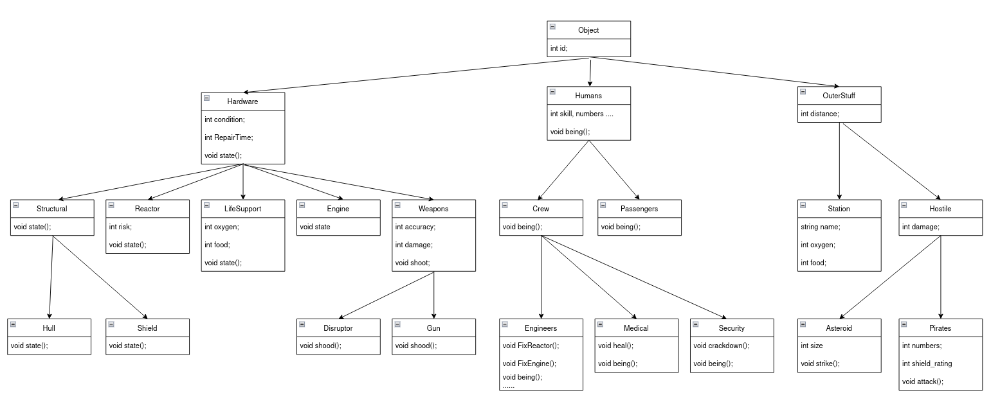

# OOP Lab 4, polymorphism

One example where Dynamic Polymorysm is present is when the Reactor/Engine/Shield class override the state() method of the inhereted Hardware class.

Multiple scenarios and endings are possible.
Base scenarios:
* the ship arrives succesfully at the destinations;
* the ship is destroyed due to any system malfunction (ractors, engines, hull, oxygen etc);
* the people on th eship die from hunger, or fighting between themselves;

Special events:
 * the ship encounters an asteroid:
 * the guns destroy the asteroid;
 * the guns partially destroy the asteroid;
 * the asteroid hits the ship and either destroys the shield or the entire ship;
 
 * a ship with pirates appear:
 * the pirates destroy the shield;
 * the ship counters the pirates with the disruptor;
 * the ship counters the pirates with the guns;
 * the pirates enter the ship and are dealt with by the security corps;
 * the pirates enter and conquer the ship stopping the journey
